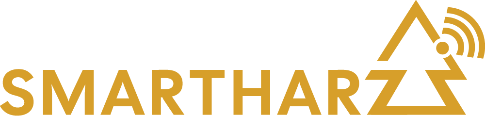

# SmartHarz (German Intro|[English below](#smartharz-english-intro))
## Wir machen den Harz Smart! 

Wir sind eine Initiative die  in der Region Harz den Ausbau einer redundanten LoRaWAN-Infrastruktur vorantreibt.
Momentan arbeiten wir bereits eng mit der Stadt Goslar und den Feuerwehren des Stadtverbandes zusammen.

Aktuell betreiben wir mehrere TTN-Gateways und decken so einen Großteil des Kernstadtgebietes ab.
In den nächsten Ausbaustufen werden weitere Gateways gemeinsam mit der Stadt beschafft und an neuralgischen Punkten montiert um die verbleibenden blinden Flecke und Stadtteile abzudecken.

Wie unser Name schon sagt, ist unser mittelfristiges Ziel, auch über die Stadtgrenzen hinaus, eine enge Zusammenarbeit mit Kommunen, Firmen und natürlich interessierten Bürgern und Verein in der gesamten Harzregion zu erreichen.

Im Rahmen unserer Arbeit bieten wir auch Workshops zu den Themen Automatisierung, Smart City und Citizen Science an.

Die Ergebnisse unserer Arbeit werden zukünftig hier unter Open Source Software (OSS) und Open Source Hardware Lizenzen bereitgestellt.
Das Erstellen von Forks und die Mitarbeit in Form von Pull Requests ist ausdrücklich gewünscht. Fehler und Fragen können an den entsprechenden Repos gerne in Form von Issues platziert werden.

# SmartHarz (English Intro)
## We develop a Smart Harz region! 
We are an initiative driving a redundant and well maintained LoRaWAN infrastructure for the Harz region.
Currently we are already working closely with the City of Goslar and the fire departments of Goslar.

Currently we are managing multiple TTN gateways which cover already most of the core city area.
Over the next iterations more gateways will be purchased in close cooperation with the magistrate to cover the remaining blind spots and city districts.

As our name implies, medium term our goal is to achieve a close cooperation, beyond the Goslar city limits, with municipalities, companies and of course interested citizens and clubs in the Harz region.

Part of our work are workshops with topics such as Automation, Smart City and Citizen Science.

The fruits of our labour will be shared here under open source software and open source hardware licenses.
Forking and opening pull requests is very welcome. Bugs and questions can be placed most easily by opening issues in the respective repos.
